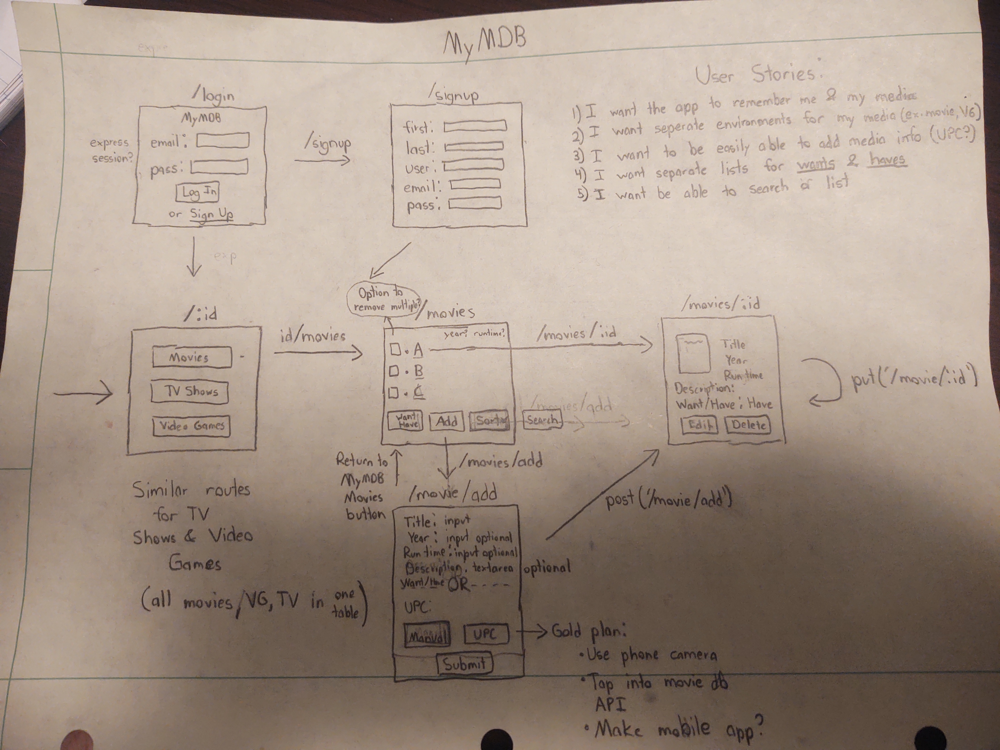
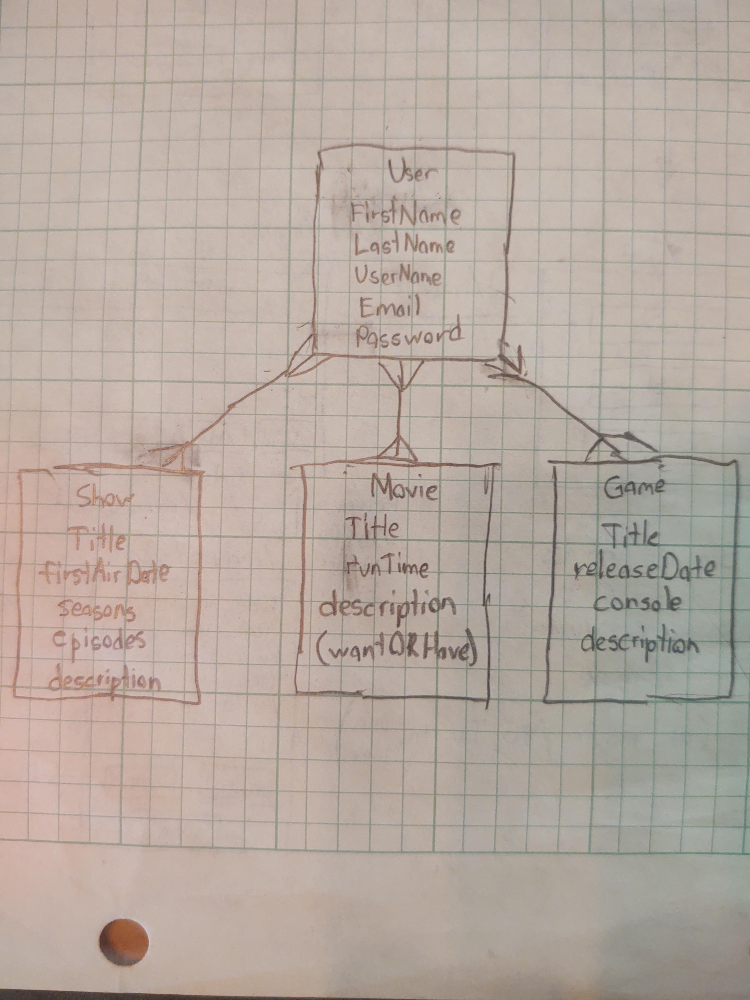

# Project 2: myMDB (My Movie DataBase)

## Objective
This project involves creating a full-stack application that:
- Uses Node.js, Postgres, Express and EJS
- Adheres to the MVC file structure
- Contains a model capable of all 7 RESTful routes and a full CRUD
- Have at least 2 models that are associated in some way
- Be deployed online using Heroku

## Description
A full CRUD app designed to hold user info on movies, video games, and TV shows

## Installation: 
- [Go to myMDB](https://my-media-db.herokuapp.com/).

## Main Features
- Able to create, edit, and delete users
- Able to create, edit, and delete medias for EACH user
    - i.e. each user has their own environment
- Sorts media by title

## User Stories
- I want the app to remember me and my media (ex. movies, games, shows)
- I want separate enviroments for my media to prevent information overload
    - Separate table for movies
    - Separate table for games
    - etc.
- I want to easily add media info
    - Make the title of the media the only neccessary component
    - Possible use of UPC scanning on movie using UPC API
- I want to separate lists by wants and haves
- I want the tables to be sorted by title
    - If time, sort by other attributes, such as year, run time, etc.
- I want to be able to add existing movies other users have to my database
- On that same note, I want to keep my entries separate from others
- I want the ability to freely edit and update my profile
- I want easy navigation
    - Follow the principles of MVP
    - ex. buttons to return to previous screens/forms
- I want to the style to be simplistic for easy loading

## Technologies Used
Javascript ES6, HTML5  
DOM Manipulation  
REST, CRUD  
Sequelize Associations  
Cloud-based Hosting (Heroku)  
Bootstrap  
EJS Partials

## The Plan
- Wireframe:

- ERD:

## The Approach
- Even though this project involves multiple media, a large portion of the time was spent on the Movie model/controller
    - Movie files were simply copied over into 'Game' and 'Show' models and edited
        - Significant code redundancy?
- The first objective was establishing CRUD, RESTful functionality
    - Used a TDD approach, minus the established tests
        - ex. When editing a movie, the following steps trialed, failed, and rectfied with minimalistic code:
            1) Can I make the specific results of that movie appear?
            2) When they do appear, can I edit them?
            3) When I do edit and submit them, does it update the database
            4) When I look at that movie again, do the results persist?
- The next objective was to establish API functionality
    - I wanted to create a system that could:
        1) Scan the UPC code on a product and gain access to the media's title
        2) With that title, use another API to find out info on the media (i.e. release year, run time)
        3) Upload this information to that specific title
    - The first option was approached with Barcode Reader and Product API
        - After several attempts at setting them up, I found their API request limits to be small
        - The documentation was also sparse on how to request temp keys for other users
    - The second option was satisfied using Movie DB API
        - However, the inputs had to be very specific, less no output would occur
        - This idea was shelved for future implementation
- Finally, the final objective was adding small features
    - Profile editing and deleting
    - Making sure only one entry of a title exists in the database
        - Wasn't sure how to account for remakes of the same name

## Unsolved Problems/Future Improvements
- Was not able to successfully utilize third-party APIs for title lookup
    - The two UPC/barcode APIs I looked into both had small requests limits
    - The actual movie database API was working
- Though options for media the user wants/needs is established, nothing was done with it
- Sorting by different attributes (ex.year) could have proven useful
- I found that in order to change user info, the user must be relogged in order to show up in the app
    - Is there a way to rectify this?
- Not optimized for mobile
    - Will fix when we learn REACT

